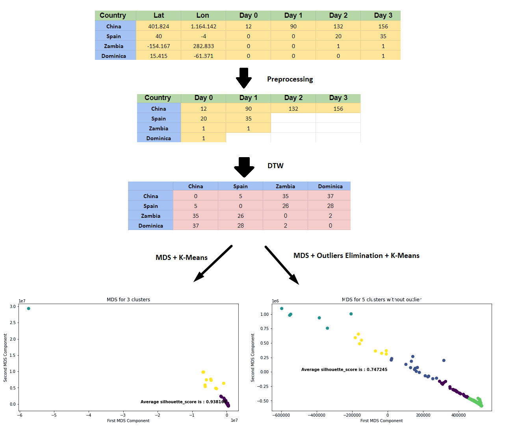

# Data Science 

This is a project implemented for the course of Data Science, AGH, Krakow, Poland 2020.

### Description

The scope of this project is to perform clustering analysis in a time series dataset regarding the COVID-19 infections. 

### Dataset

The official dataset of the [COVID-19 infections](https://github.com/CSSEGISandData/COVID-19/blob/master/csse_covid_19_data/csse_covid_19_time_series/time_series_covid19_confirmed_global.csv) from [CSSEGISandData](https://github.com/CSSEGISandData) it is used. 
 

### Implementation

    

## Collaborators ✨

<!-- All-Collaborators-LIST:START -->
<table>
  <tr>
    <td align="center"><a href="https://github.com/rumeysaozaydin"> <b>rumeysaozaydin</b></a> 💻</td>
    </tr>
</table>

<!-- All-Collaborators-LIST:END -->

## Licenses

